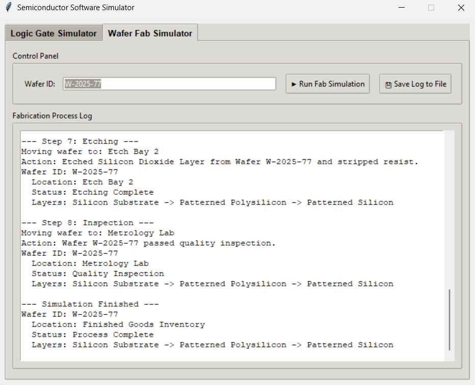

# 🧠 Semiconductor Logic & Wafer Fab Simulator (GUI)

An interactive Python GUI application that simulates:
- ✅ Digital Logic Gates (AND, OR, NOT, NAND, NOR, XOR)
- ✅ Semiconductor Wafer Fabrication Process (deposition, lithography, etching, inspection)

Built with **Tkinter**. Useful for students and enthusiasts learning electronics and semiconductor manufacturing.

---

## 🚀 Features

### 🔢 Logic Gate Simulator
- Toggle inputs A and B using checkboxes
- Instantly view the output of all 6 gates:
  - AND, OR, NOT A, NAND, NOR, XOR

### 🧪 Wafer Fab Process Simulator
- Enter any custom **Wafer ID**
- Simulates:
  - Deposition of a random material
  - Lithography
  - Etching
  - Quality Inspection (with possible failure)
- Logs each step visually

### 💾 Export Logs
- Save the entire wafer simulation log to a `.txt` file

---

## 🖼️ Screenshots

| Logic Gate Tab | Wafer Fab Tab |
|----------------|---------------|
|  |  |

---

## 🛠 Technologies Used

- Python 3.8+
- Tkinter (GUI)
- Object-Oriented Programming
- PyInstaller (for `.exe` packaging)

---

## 📦 How to Run

### 🔧 Option 1: Run with Python

```bash
python main.py
